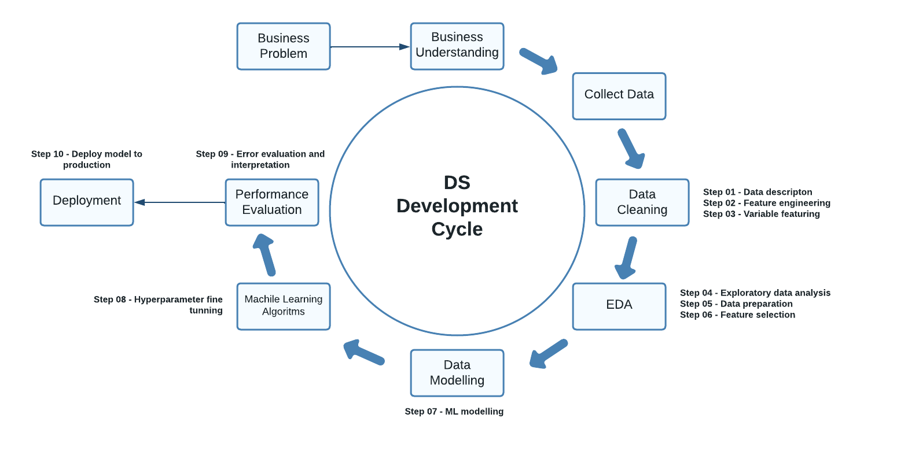

# Rossmann Sales Prediction Project

Insights Project

## 1. Business Problem
Sales forecasting refers to the process of estimating demand for or sales of over a specific period of time. It can improve financial performance of any kind of business and in a major company as Rossmann it is particular import because any variation in demand could impact all stores at once. A accurate sales forecast could reduce stock and wast, as well as in-store availability issues.

Rossmann is one of the largests drug store chains in Europe owning over 3,000 stores across Germany, Poland, Hungary, the Czech Republic, Turkey, Albania, Kosovo. This problem set was coming from a Kaggle competition driven by Rossmann itself in 2015. The main goal was to predict each store daily sales for up to six weeks in advance. The dataset contains sales from 1115 stores in diferent days from 2013-01-01 to 2015-07-31, and other factors such as holidays, promotions and competion.

As part of "DS em Produção" course in "Comunidade DS" this problem was incremented with some more **fictional data** as is descripted below:

"Pretend you are a data scientist in Rossmann company. Suddenly a lot of messages pops up at your screen, reading all you figured out they all have the same demading: the store sales prediction for 6 weeks in advance. It seems all store managers were asked by the CFO of the company to have this prediction by the end of the month. You go talk to the CFO to undertand what is the real problem and if this prediction it is the bst solution. CFO tells you that Rossmann is going throught an expansion and needs to estimate accurately the amount of money they will loan from banks, they plan to use the part of the income from the next 6 weeks as part of the expansion investment. After that you agreed that the prediction makes sense and you can create a unique solution for all the stores. He went thrilled by the idea and also ask you to create a way the solution could be accessed by any store manager at any time and returns intantaneously the sales prediction for the store, so they can use in other occasions."

| Problem | Root Cause | Main Question |
| --- | --- | --- |
| How much money company need to loan | Company expansions | What will be the sales day by day in each store for next six weeks? |

## 2. Business Assumptions
- Stores with no competition distance information does not have nearby competitors, so we will consider a distance to high to be relevant.
- Some stores have a nearby competitor but do not have competition_since_month/year information. Since we consider the date when a new competitor is installed very important to this problem, we will consider this date the dale as sales date.
- Same consideration above for columns promo2_since_week/year.
- It was not been considered days with sales equal to 0 or store closed.
- We considered that customers it is a variable unavailable in the moment of prediction, so it was removed from dataset.

## 3. Solution Strategy
### 3.1. Final Product
- Report in a csv file with sales day by day for each store of the company.
- Telegram bot accessed by API

### 3.2. Tools
- Python
- Jupyter Notebook
- Render
- Telegram
- Git
- API Flask

### 3.3. Process
The solution process is based in CRISP-DM methodology, which stands for Cross Industry Process - Data Mining. It was developed by a consortium of over 200 interested organizations and it is flexible to suit many analytical methods such as Data Science.Launched in 1999 it is until today by far the most widely-used analytics process standard. It is originally composed by six phases, but the version used here in this project it is extended to ten.

- Step 01: Data description: renaming columns, changing data types, fillout NA, descriptive statistics.
- Step 02: Feature engineering	
- Step 03: Variable filtering
- Step 04: Exploratory data analysis
- Step 05: Data preparation
- Step 06: Feature selection
- Step 07: Machine learning modelling
- Step 08: Hyperparameter fine tunning
- Step 09: Error evaluation and interpretation
- Step 10: Deploy model to production
    
# 4. Data Collect

- **Dataset was collected from Kaggle: [here](https://www.kaggle.com/competitions/rossmann-store-sales‘)**
    
	It contains sales for 1,115 Rossmann stores. Some stores in the dataset were temporarily closed for refurbishment.
    
- **The dataset has 19 attributes listed below:**

| Item | Description |
| --- | --- |
| id  | an Id that represents a (Store, Date) duple within the test set |
| store | a unique Id for each store |
| day_of_week | day of the week |
| date | date |
| sales | the turnover for any given day (this is what you are predicting)  |
| customers |  the number of customers on a given day |
| open | an indicator for whether the store was open: 0 = closed, 1 = open |
| promo | indicates whether a store is running a promo on that day |
| state_holiday | indicates a state holiday. Normally all stores, with few exceptions, are closed on state holidays. Note that all schools are closed on public holidays and weekends. a = public holiday, b = Easter holiday, c = Christmas, 0 = None |
| school_holiday |  indicates if the (Store, Date) was affected by the closure of public schools |
| store_type | differentiates between 4 different store models: a, b, c, d |
| assortment | describes an assortment level: a = basic, b = extra, c = extended |
| competition_distance | distance in meters to the nearest competitor store |
| competition_open_since_month | gives the approximate year and month of the time the nearest competitor was opened |
| competition_open_since_year | gives the approximate year and month of the time the nearest competitor was opened |
| promo2 | Promo2 is a continuing and consecutive promotion for some stores: 0 = store is not participating, 1 = store is participating |
| promo2_since_week | describes the year and calendar week when the store started participating in Promo2 |
| promo2_since_year | describes the year and calendar week when the store started participating in Promo2 |
| promo_interval | describes the consecutive intervals Promo2 is started, naming the months the promotion is started anew. E.g. "Feb,May,Aug,Nov" means each round starts in February, May, August, November of any given year for that store |

- All rows missing competition_distance also missed competition_since_month/year
- Column 'is_promo' is created to tells if the day is in promo or not.
    
## 5. Top 5 Insights

### 5.1. Hypothesis Mindmap
A mindmap of hypothesis was created together with business team (marketing, saled, product) to create hypothesis about the problem. This step is important to look for important insights that will help find the best solution.

From all hypothesis, it will only be taken in consideration those who have data available. Thus, hypothesis about customers or location were not added to the analysis. A total of 10 hypothesis we evaluated and at the end we could validate 5 important insights.

| Nº | Insights |
| --- | --- |
| 01 - Homes with waterfront are 20% more expensive than homes without waterfront. |
|  |
| 02 - Homes constructed before 1955 are 50% cheaper than homes constructed in 1955 and after. |
| 03 - Homes without basement are 40% larger than homes with basement. |
| 04 - The growth of home’s prices YoY (Year of Year) is 10%. |
| 05 - Homes with 3 bathrooms has a growth MoM (Month over Month) of 15%. |

# 6. Machine Learning Model Applied

After adjusting the hypothesys statements in the exploration data three insights

| Insights | Action |
| --- | --- |
| 01 - Homes with waterfront are 20% more expensive than homes without waterfront. | Buy homes with waterfront. |
| 07 - Homes renovated in the past 5 years are 20% more expensive than homes who were not. | Buy homes renovated in the last 5 years. |
| 06 - Homes with more than 1 floor are 40% more expensive than homes with only 1 floor. | Buy homes with more than 1 floors |

# 7. Model Performance

# 8. Deployment

# 9. Business Results

It was generated a table containing only the homes recommended to buy together with their selling prices. New columns were created.

[See entire table here in csv](table-selling-prices.csv)

| Total costs on home purchases | Total income from home sales | Total profit |
| --- | --- | --- |
| $ 4,079,586,744.00 | $ 4,832,502,714.60 | $ 752,915,970.60 |

# 10. Conclusion

The solution presented is this project satisfied the company’s requirements. It was observed that having a view or waterfront, good condition, more floors and a recent renovation are characteristics that value real estate. And from the rejected hypothesis is interesting to pointed out that the price growth YoY is only 1.05%, so it is not a good strategy to wait a year or two to sell the house. It is know from the research that the main streategy of the iBuyers is to sell the homes as soon as possible.

# 11. Next Steps

- Separate train and test data since from the very beginning of the project to avoid data leakage.
- Look for external data such as weather, national events, macro indicators and etc.
- Try to group stores by region.
- Adjust competition_open_since_year/month to a single date for each store.

# 12. References

[https://www.kaggle.com/competitions/rossmann-store-sales](https://www.kaggle.com/competitions/rossmann-store-sales)

[https://www.theretailbulletin.com/retail-solutions/case-study-rossmann-successful-supply-chain-coronavirus-crisis-management-11-12-2020/](https://www.theretailbulletin.com/retail-solutions/case-study-rossmann-successful-supply-chain-coronavirus-crisis-management-11-12-2020/)

[https://www.forbes.com/sites/metabrown/2015/07/29/what-it-needs-to-know-about-the-data-mining-process/?sh=6fe236bb515f](https://www.forbes.com/sites/metabrown/2015/07/29/what-it-needs-to-know-about-the-data-mining-process/?sh=6fe236bb515f)

[https://www.kaggle.com/competitions/rossmann-store-sales/discussion/17229](https://www.kaggle.com/competitions/rossmann-store-sales/discussion/17229)

